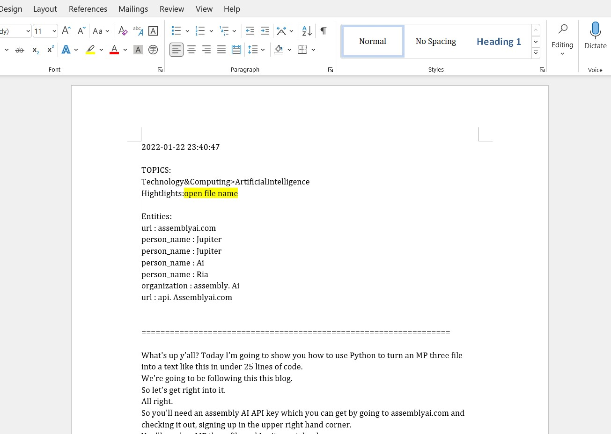

# AutoNoteTaking
AutoNoteTaker is a speech to text program that transcribes ALL your lectures (and any other videos) for you automatically! 
This program was developed for the AssemblyAI challenge at MacHacks 2, and our main inspiration behind it as online students was to create something that could help make the lives of all students easier, and facilitate their learning.

Sample output of an audio to a word document:\

